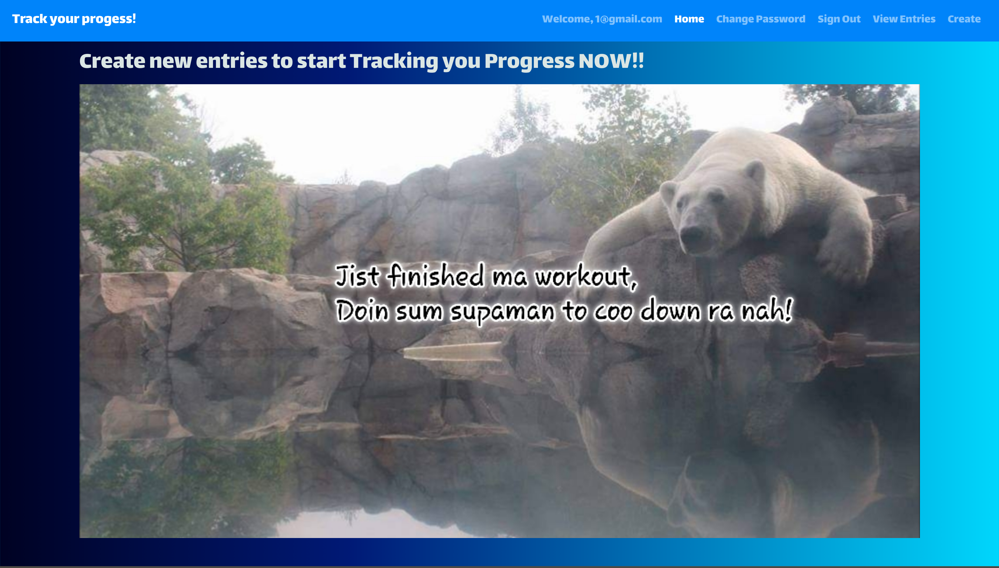

# Fitness Tracker Client

### Description
An app to record your fitness progress, a user can:
- Create new accounts.
- Authenticated user can change password if needed.
- Authenticated user can create, update, and delete entries.

### Important Links
- [API Repository](https://github.com/TN-space/fitness-tracker-api)
- [Deployed API](https://murmuring-forest-24947.herokuapp.com)
- [Client Repository](https://github.com/TN-space/fitness-tracker-client)
- [Deployed Client](https://TN-space.github.io/fitness-tracker-client)

### Planning Story
#### Technologies Used
- Back-end: Ruby on Rails.
- Front-end: JavaScript, React, axois, hook, react-bootstrap, react-router-dom.

#### User Stories
- As an unregistered user, I want to sign up with email and password.
- As a registered user, I want to sign in with email and password.
- As an authenticated user, I want to change password.
- As an authenticated user, I want to sign out.
- As an authenticated user, I want to create a new entry.
- As an authenticated user, I want to update my created entry.
- As an authenticated user, I want to delete my created entry.
- As an authenticated user, I want to view all my created entries.

#### Catalog of Routes
| Verb   | URI Pattern    | Result              |
|:-------|:---------------|:--------------------|
| GET    | `/entries`     | show all user's entries|
| GET    | `/entries/:id` | show one entry|
| POST   | `/entries`     | create a new entry |
| PATCH  | `/entries/:id/update-entry`| update an existing entry|
| DELETE | `/entries/:id` | delete an existing entry |

### Images

#### App Screenshot

#### Wireframe

### Stretch Goals
- Implement a filter by time (oldest to newest and vice versa), my activity, etc
- Click-able date, when clicked will show all entries with the same date.
- Create a search bar that will able to search for similar words.
